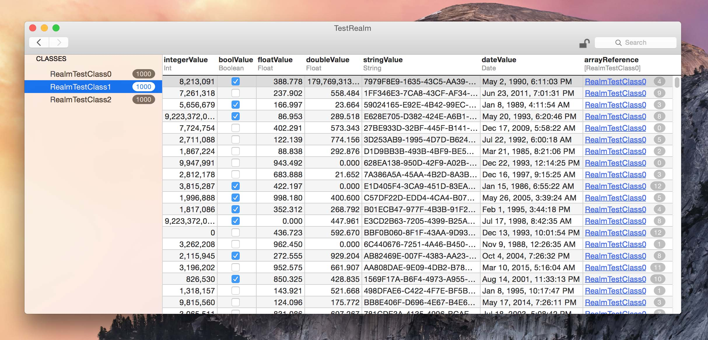

# Realm Browser (Private Sync Edition)
Realm Browser is a small utility for Mac OS X that lets you open .realm files to view and modify their contents.

This version has been modified to provide access and introspection to .realm files backed by Realm Sync.

## Installing

### Manual Build
Download the project from this repo. To install all of the external dependencies, install CocoaPods and call the command `pod install` in the project directory. To install Realm with Sync, please [visit the sync releases](https://github.com/realm/realm-sync-kp/releases) and download the Realm Cocoa framework for OS X.

## License
The public source code to Realm Browser is licensed under the [Apache License 2.0](http://www.apache.org/licenses/LICENSE-2.0).
The private components are subject to Realm Incorporated's 'REALM CONFIDENTIAL' agreement.
